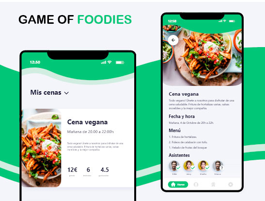

 
- [Descripción general](#descripción-general)
- [Arquitectura del servicio](#arquitectura-del-servicio)
- [Tecnologías y patrones](#tecnologías-y-patrones)
  - [Global](#global)
  - [Capa de aplicación](#capa-de-aplicación)
  - [Capa de infraestructura](#capa-de-infraestructura)
  - [Capa de presentación](#capa-de-presentación)
- [Uso](#uso)
  
# Descripción general
API REST desde cero usando .NET 6 en C# y con la tecnología WebAPI. Para el desarrollo del proyecto se han seguido los principios de la Arquitectura Limpia (Clean Arquitecture) y los principios del Diseño Impulsado por el Dominio (DDD). 
El sistema backend tiene un sistema de autenticación basado en JWT y la creación, lectura, actualización y eliminación de cenas.

# Arquitectura del servicio
El servicio esta distribuido en 4 capas diferentes, cada una con sus propias responsabilidades y permiten mantener nuestro código separado y ordenado: 
* Dominio: núcleo del sistema donde se definen los agregados, los objetos  de valor y demás entidades o modelos que pertenecen a la lógica de negocio.
* Aplicación: en ella aplicamos los diferentes patrones de diseño y demás lógica que forma parte de los casos de uso y depende directamente de la capa de dominio.
* Infraestructura: encontramos las implementaciones concretas de los servicios/interfaces definidas en la capa de aplicación.
* Presentación (API): encargada de conectar nuestro sistema con el mundo exterior y en este caso donde aplicamos la arquitectura API Rest
  
# Tecnologías y patrones
## Global
* ASP .NET 6
* dotnet CLI
* Visual Studio Code
* Inyección de dependencias
  
## Capa de aplicación
* Patron repositorio
* Patron CQRS
* Patrón Mediador
* Validación de las solicitudes del mediador
* Json Web Token 
  
## Capa de infraestructura
* Entity Framework
  
## Capa de presentación 
* API Rest
* Mapster
* Mediador

# Uso
Para ejecutar este proyecto, debes tener instalado el SDK de .NET 6.0. Después clona o descarga este repositorio y ejecute el siguiente comando.
```
dotnet run --project .\BuberDinner.Api\